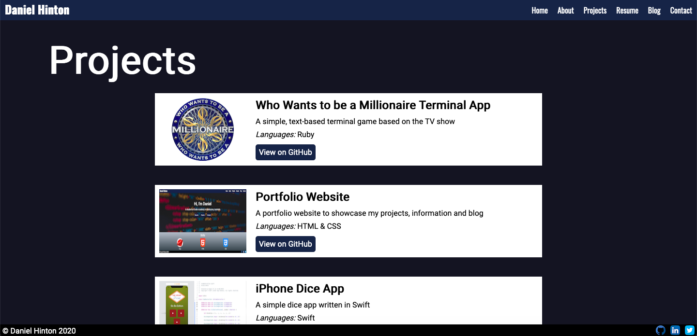

# Portfolio Website

http://danieljhinton.com/

https://github.com/djh900/Daniel_Hinton_T1A3

### Purpose

The purpose of this project was to create a portfolio website in order to showcase my talents to prospective employers.
The website incorporates several pages containing details about me, how to contact me, and blog posts to fulfil the project rubric requirements.

### Functionality and Features

### Sitemap

- Index.html
- About.html
- Projects.html
- Resume.html
- Blog.html
- Contact.html
- Blog
  - 20 May blog post (html)
  - 21 May blog post (html)
  - 22 May blog post (html)
  - 23 May blog post (html)
  - 24 May blog post (html)
- Images
- Styles
  - Style.css
  - Style.scss
  - Partials
    - \_navbar.scss
    - \_footer.scss
    - .scss partials for each page

### Screenshots

##### Desktop

##### Mobile

### Target Audience

### Tech Stack

- HTML
- CSS
- Sass
- CPanel
