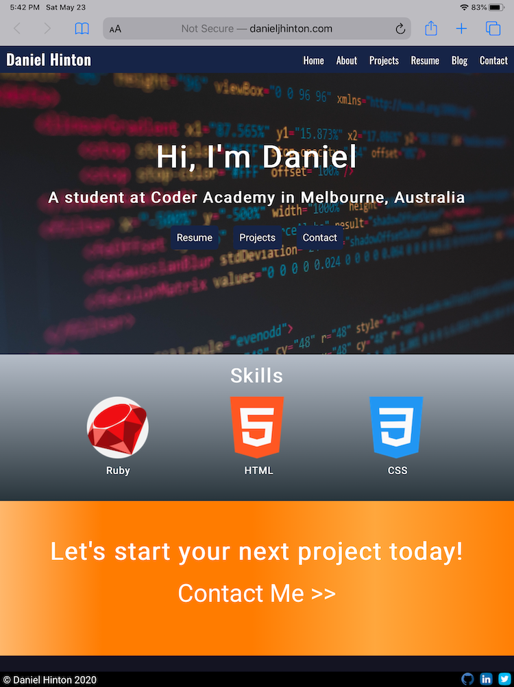
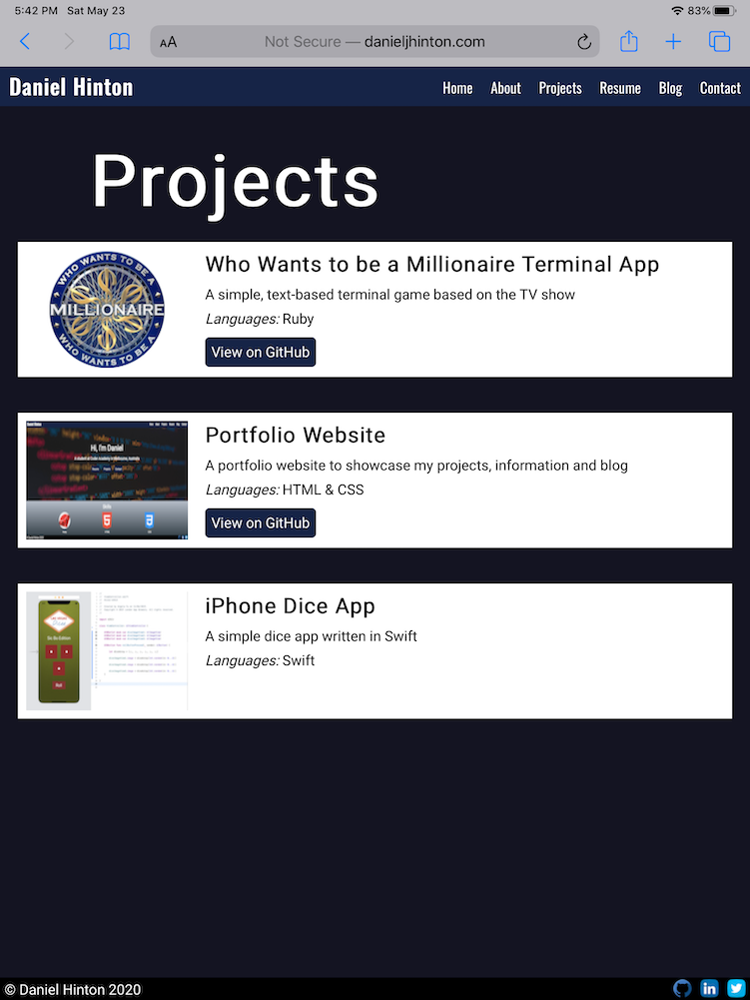

# Portfolio Website

http://danieljhinton.com/

https://github.com/djh900/Daniel_Hinton_T1A3

### Purpose

The purpose of this project was to create a portfolio website in order to showcase my talents to prospective employers.
The website incorporates several pages containing details about me, how to contact me, and blog posts to fulfil the project rubric requirements.

### Functionality and Features

The website has a homepage, five main, other pages, and five pages containing blog posts linked from the 'Blog' page.

The homepage contains a large heading introducing myself, buttons linking to my projects, resume and contact details, with a tech-related background image. Below that there is a section highlighting my tech skills, and below that a call to action asking people interested in my work to contact me. With Javascript and as i obtain more skills, I would like the skills section to contain arrows on either side, where users can scroll through and see all my skills.

The website's pages all have a static navigation bar at the top, with links to the major pages, and a static footer at the bottom with my name and links to three social media accounts I want promoted on the site.

All the website's pages other than the homepage have a large, off-center header at the top (except on mobile where they are centered) with the name of the page.

The about page contains a large picture of me and text detailing some information about me, with links to my blog and contact page.

The projects page showcases three projects, the two I have worked on at Coder Academy so far, including links to their GitHub repositories, and one project I have built as I learned to code in Swift.

The resume page's functionality differs based on device. On desktop and tablet, it displays an embedded PDF version of my resume. On iOS, this does not display, however there is still the heading with the option to download the resume. On Android, the resume downloads automatically upon clicking the Resume link in the navigation bar.

The blog page is similar to the projects page, highlighting my five blog posts with their titles, a short description, and image. These all link to individual blog posts that contain the blog post title, name and date, a picture, and the blog content.

Finally, the contact page containg both a request for users to email me, a contact form with Name, Email and Message inputs, and a Select bar, and my social media links.

### Sitemap

- Index.html
- About.html
- Projects.html
- Resume.html
- Blog.html
- Contact.html
- Blog
  - 20 May blog post (html)
  - 21 May blog post (html)
  - 22 May blog post (html)
  - 23 May blog post (html)
  - 24 May blog post (html)
- Images
- Styles
  - Style.css
  - Style.scss
  - Partials
    - \_navbar.scss
    - \_footer.scss
    - .scss partials for each page

### Screenshots

#### Desktop

#### Mobile

#### Tablet

### Target Audience

The target audience for this project is primarily employers wanting to see my skills as a potential employee.
There are also secondary audiences, such as friends and business connections, who whilst not looking to hire me, may still be interested in my work.

### Tech Stack

- HTML
- CSS
- Sass
- CPanel
